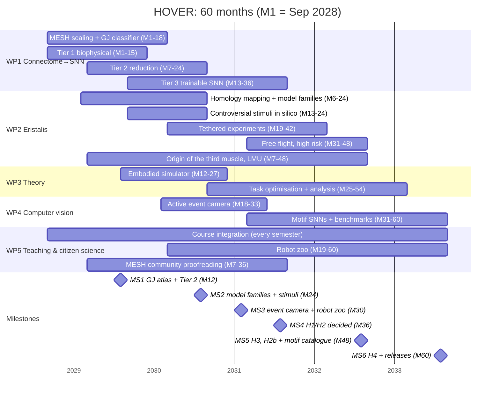

# Timeline

Planned start **1 Sep 2028** (placeholder). Final ERC results arrive 17 Dec 2027, followed by grant
preparation. M = project month; MS = milestone (see B2 §3).

```mermaid
gantt
    dateFormat  YYYY-MM
    axisFormat  %Y
    title HOVER: 60 months (M1 = Sep 2028)
    section WP1 Connectome→SNN
    MESH scaling + GJ classifier (M1-18)      :w11, 2028-09, 18M
    Tier 1 biophysical (M1-15)                :w12, 2028-09, 15M
    Tier 2 reduction (M7-24)                  :w13, 2029-03, 18M
    Tier 3 trainable SNN (M13-36)             :w14, 2029-09, 24M
    section WP2 Eristalis
    Homology mapping + model families (M6-24) :w21, 2029-02, 19M
    Controversial stimuli in silico (M13-24)  :w22, 2029-09, 12M
    Tethered experiments (M19-42)             :w23, 2030-03, 24M
    Free flight, high risk (M31-48)           :w24, 2031-03, 18M
    Origin of the third muscle, LMU (M7-48)   :w25, 2029-03, 42M
    section WP3 Theory
    Embodied simulator (M12-27)               :w31, 2029-08, 16M
    Task optimisation + analysis (M25-54)     :w32, 2030-09, 30M
    section WP4 Computer vision
    Active event camera (M18-33)              :w41, 2030-02, 16M
    Motif SNNs + benchmarks (M31-60)          :w42, 2031-03, 30M
    section WP5 Teaching & citizen science
    Course integration (every semester)       :w51, 2028-09, 60M
    Robot zoo (M19-60)                        :w52, 2030-03, 42M
    MESH community proofreading (M7-36)       :w53, 2029-03, 30M
    section Milestones
    MS1 GJ atlas + Tier 2 (M12)               :milestone, 2029-08, 0d
    MS2 model families + stimuli (M24)        :milestone, 2030-08, 0d
    MS3 event camera + robot zoo (M30)        :milestone, 2031-02, 0d
    MS4 H1/H2 decided (M36)                   :milestone, 2031-08, 0d
    MS5 H3, H2b + motif catalogue (M48)       :milestone, 2032-08, 0d
    MS6 H4 + releases (M60)                   :milestone, 2033-08, 0d
```
