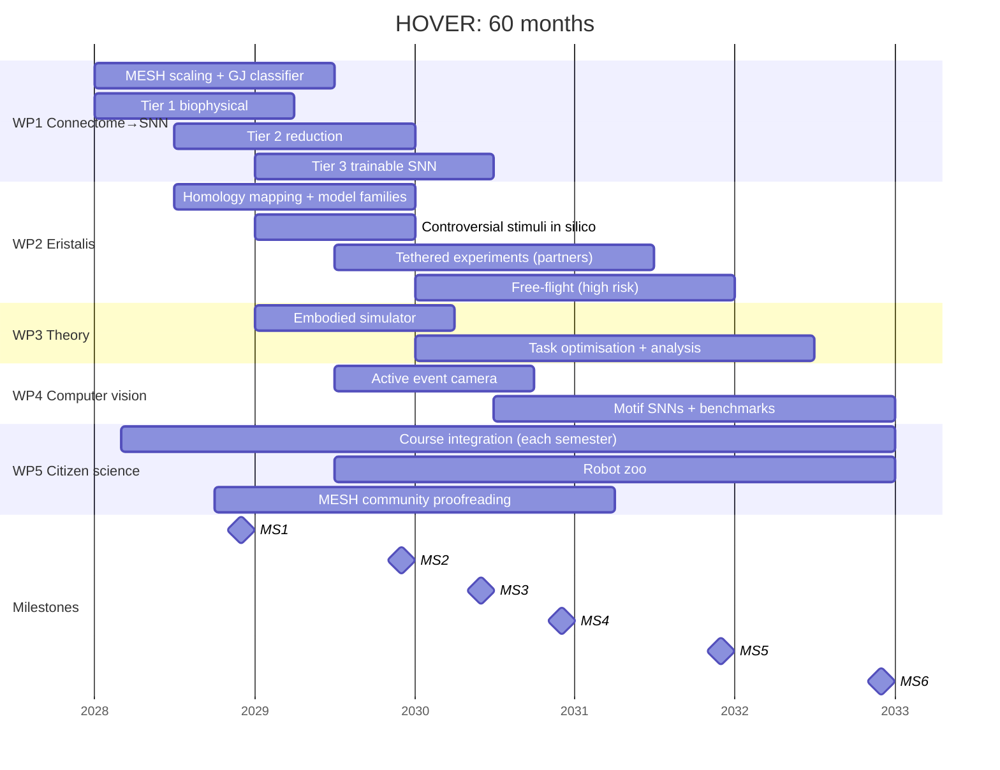

# Timeline (start date placeholder: 2028-01-01)

```mermaid
gantt
    dateFormat  YYYY-MM
    axisFormat  %Y
    title HOVER: 60 months
    section WP1 Connectome→SNN
    MESH scaling + GJ classifier      :w11, 2028-01, 18M
    Tier 1 biophysical                :w12, 2028-01, 15M
    Tier 2 reduction                  :w13, 2028-07, 18M
    Tier 3 trainable SNN              :w14, 2029-01, 18M
    section WP2 Eristalis
    Homology mapping + model families :w21, 2028-07, 18M
    Controversial stimuli in silico   :w22, 2029-01, 12M
    Tethered experiments (partners)   :w23, 2029-07, 24M
    Free-flight (high risk)           :w24, 2030-01, 24M
    section WP3 Theory
    Embodied simulator                :w31, 2029-01, 15M
    Task optimisation + analysis      :w32, 2030-01, 30M
    section WP4 Computer vision
    Active event camera               :w41, 2029-07, 15M
    Motif SNNs + benchmarks           :w42, 2030-07, 30M
    section WP5 Citizen science
    Course integration (each semester):w51, 2028-03, 58M
    Robot zoo                         :w52, 2029-07, 42M
    MESH community proofreading       :w53, 2028-10, 30M
    section Milestones
    MS1 :milestone, 2028-12, 0d
    MS2 :milestone, 2029-12, 0d
    MS3 :milestone, 2030-06, 0d
    MS4 :milestone, 2030-12, 0d
    MS5 :milestone, 2031-12, 0d
    MS6 :milestone, 2032-12, 0d
```
